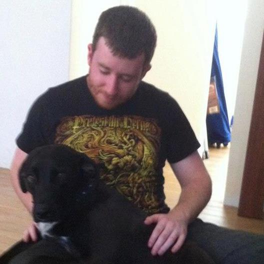

# Managing Bad Code

Bad code sinks projects.

Bad code makes maintaining old code bases expensive and demoralising for developers to work on.

Bad code starts accumulating as soon as the first commit is made to the repo.

Here's the short version:

Everybody writes bad code. Not everybody knows they write bad code. I'm going to talk with you about how I think we can identify, manage, and prevent bad code from entering your repo. This is a general software engineering talk that will use solutions based in Ruby, aimed at Ruby development teams (Rails and RubyMotion).

Here's the long version:

- What is bad code? Where does it originate from?
  - How does bad code come to be? Can't we all just be better developers? - A broad look at what bad code is and some of the causes of bad code
  - Identifying bad code - A look at [code smells](http://www.codinghorror.com/blog/2006/05/code-smells.html)
  - What are the costs? - A look at the obvious and not so obvious costs of bad code. A review of the [opportunity costs](http://en.wikipedia.org/wiki/Opportunity_cost) we deal with by accepting bad code.
  - The uniform skill level problem - Not all developers code at the same level of skill. A guide to how we can accomodate that as a team.
  - The uniform code quality output problem - Developers all have bad days. A guide to how we can deal with our bad days.
  - Know thy enemy: Developers - You are your own worst enemy. How to accept that you are not perfect and hopefully embrace a more humble and open-to-learn attitude. Do you need an attitude re-adjustment?

- How do we manage existing bad code?
  - Band aids are best for small cuts - A discussion on why I think band aid solutions should be absolutely avoided when maintaining code. A look at when you may have to use a band aid solution.
  - Refactoring is king - A look at how draconic refactoring should be used on older, less active code bases in order to rapidly and dramatically improve code quality
  - [The boy-scout rule](http://programmer.97things.oreilly.com/wiki/index.php/The_Boy_Scout_Rule) - A look at the boy-scout rule and why I think developers packing it in on older code bases is bullshit.
  - When to sever the limb - Is a complete rewrite ever called for? My experience with rewrites and why I think rewrites are often just a siren singing a song too good to be true.

- How do we prevent bad code, moving forward?
  - Refactoring:
    - I think refactoring needs to become embedded in the development life cycle. I'll explain how and why!
  - Code Reviews:
    - A look at the benefits of code reviews and discussion as to why I think code reviews need to be prioritised in the development life cycle. I'll explain how and why!
    - An overview of the various techniques (async vs sync, shallow vs deep, in person vs stuck to a wall etc)
    - How To: Automatic using [Code Climate](https://codeclimate.com/)
      - What kind of defects can Code Climate find?
      - How can I leverage Code Climate to improve code quality?
      - Is it worth it?
    - How To: Manual using [GitHub's Pull Requests](https://help.github.com/articles/using-pull-requests)
      - Building an informative description for your pull request to assist reviewers
      - Reviewing other developers work - you're probably being an asshole. I will go through some of the most common pit-falls when reviewing other developers's code. I will also be talking about ways to maximise the code review process. Problems you should look out for and refactoring options you probably hadn't considered. Some tips on how you can learn to become an better reviewer (Trust me! There's a colossal amount of variance in skill levels in reviewers - not necessarily correlated with the developer's programming ability, either).
  - Skill Development:
    - This is a pretty cheesy topic. I'll provide a laundry list of textbooks that all developers should read and some other text books specific to Rails and RubyMotion developers. This will include the classics like Code Complete, Peopleware, Pragmatic Programmer etc, which I will be quoting and drawing inspiration from extensively in this talk. I'll also include some textbooks you may not expect to see on a software developer's booklist.
  - Documentation will save your soul 6 months down the track:
    - A discussion on the role of documentation. When to document, when not to document. Examples specific to Rails and RubyMotion projects.
    - While you're here, why not [read my blog post on writing a good readme](http://blog.thefrontiergroup.com.au/2013/05/writing-a-good-readme/)?
  - Using gems (or cocoapods!):
    - A reminder to always look for a gem that is doing what you are trying to achieve. Code you don't write is code you don't have to maintain. There's a good chance the problem you're trying to solve is:
      - Already solved
      - Not as easy to solve as you think

And more, depending on whether this talk gets selected!

## Jordan Maguire

My name is Jordan Maguire.

I'm a developer from Perth, Western Australia. I have worked on Rails projects for the last four years and RubyMotion projects for the last year. I've delivered some high quality work, and some not-so-high quality work.

I've learned from my mistakes and the mistakes of my team as well. As a result, improving the quality of my code is my top priority.

- [My website](http://www.thefrontiergroup.com.au/)
