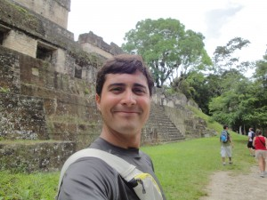

# Why 25% of your test suite is worthless and what you can do about it.

I present novel research that indicates that test suites for open source projects have an average of 25% redundancy, while those for closed-source projects have 40% or more. Redundant tests give teams the false sense of increased coverage. Further, they actually increase maintainability and running costs, while exposing the project to costly test escapes. Just as there is code that "does the same thing," there are tests that "test the same thing." But how do you detect them? How do you find and deal effectively with them? This talk presents a solution: a free tool that quickly finds how redundant your test suite really is.
Audience will learn:
* The state of test suites in open-source projects, as well as in some closed-source projects.
* How redundant tests increase the risk and cost of testing.
* An introduction into several techniques to assess how good a test suite really is.
* An introduction into the tool and how to use it in their projects.
* Terminology and definitions used to communicate effectively about redundant tests across teams.

## Mario Gonzalez Macedo

I started working on the unified theory of testing since college. At IBM, I got a chance to expand it and apply it, especially when working with customers for root-cause analysis in our enterprise storage products, as well as in development. Reachability graphs was one result of my work.

After IBM, I formed my own company called Ortask, where I now focus my attention developing tools that make testers more efficient, as well as researching/evangelizing testing techniques that have shown to yield high-quality results. Not surprisingly, I use both the theory and the tools quite often in my own testing.

I'm also currently writing a book that explains the unified theory of testing and all its useful details. the book will hopefully be available some time in 2014.

- [website](http://ortask.com)
- [twitter](https://twitter.com/maramono)
- [blog](http://ortask.com/blog)
- [screencasts](http://www.youtube.com/user/TheOrtaskTeam)
