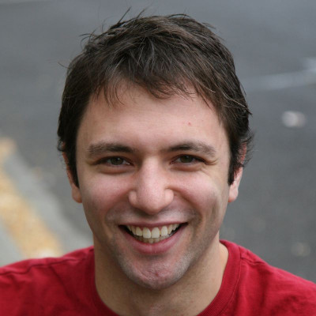

#Writing Games with Entity Systems and JRuby
Entity Systems are a relatively new style of software development that came out of the game industry to avoid some of the common architectural pitfalls of Object Oriented programming when developing games, and attempt to provide a much cleaner separation between aspects such as rendering, physics, AI and other parts of a game's ecosystem.

In this talk we'll live code a simple game with JRuby and libGDX and provide it with some interactivity and physics so you can get a feel for how Entity Systems work, and inspire you with your own game architectures.  Not only limited to games, this talk should also make you think about how you design other types of software that have a view layer powered by a highly dynamic data set.

## Mark Mandel

Mark Mandel has been a full time consultant for quite a number of years, and writing software for well over a decade. He built his career mainly on ColdFusion, but over the past few years has been transitioning much of his work over to JRuby as well as dabbling further in various other languages on the JVM.

When he's not too busy coding (at work, or on the side) he enjoys training martial arts in a wide variety of disciplines and reading way too much fantasy literature.

- [My website](http://www.compoundtheory.com/)
- [My twitter](http://twitter.com/neurotic)
- [Past talk slides as cf.Objective 2012](https://github.com/markmandel/closureonclosures)
- [Past talk slides at cf.Objective 2011](http://prezi.com/euocvk1tfuvm/aop-for-you-and-me/)
- [Past talk video at Adobe MAX 2009](http://tv.adobe.com/watch/max-2009-develop/coldfusion-for-java-developers/)

(Sorry for the ColdFusion presentation links, they are the only presentations I have available online).